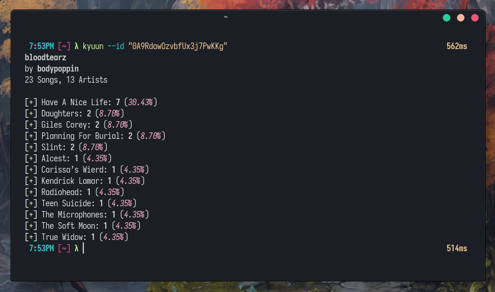

# kyuun 🍒

[](https://github.com/fawni/kyuun/actions)
[](https://crates.io/crates/kyuun)

A simple Spotify playlists analyzer

## Motivation

Sometimes i want a quick summary about a playlist to ~~judge~~ get a general idea of what it offers. For me it's particularily interesting for the unique playlists that Spotify taylors to each user!



It simply lists the artists and how many times they appear in the playlist along with some other basic stats but i might add more stuff in the future!

## Installation

### Prebuilt

Static binaries are automatically released [here](https://github.com/fawni/kyuun/releases), which can also be installed using [cargo-binstall](https://github.com/cargo-bins/cargo-binstall)

```
cargo binstall kyuun
```

### crates.io

```
cargo install kyuun
```

### Usage

1. Create a new app in the [Spotify dev dashboard](https://developer.spotify.com/dashboard)
2. Add `http://localhost:1410` as a Redirect URI and make note of `Client ID` and `Client secret`
3. Run `kyuun setup` and follow the instructions
4. Now you can use kyuun by running `kyuun` or `kyuun --id <playlist id>`

### License

[ISC](LICENSE)
